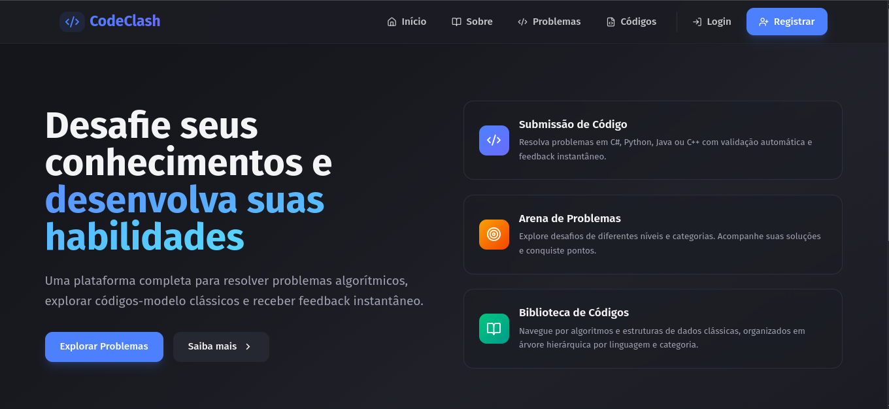
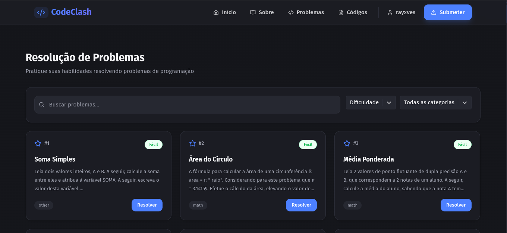
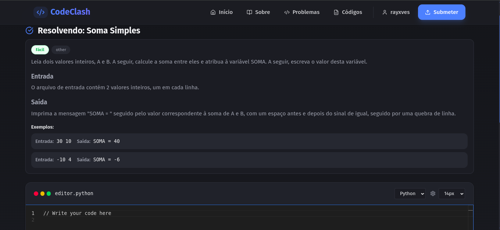
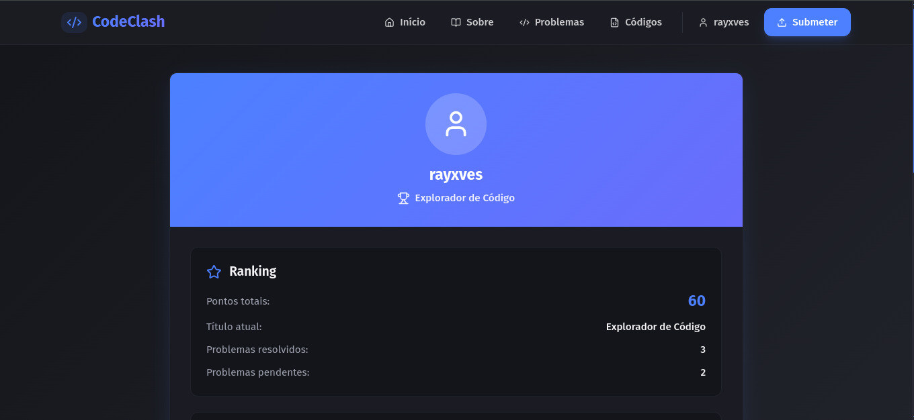

# CodeClash 🚀

> Uma plataforma completa para dominar algoritmos, resolver desafios e evoluir suas habilidades de programação.

## 📋 Sobre o Projeto

**CodeClash** é uma plataforma interativa de aprendizado de programação que combina resolução de problemas algorítmicos, exploração de códigos-modelo e recomendações inteligentes. Desenvolvido como projeto acadêmico, implementa diversos padrões de projeto e boas práticas de arquitetura de software.

---

## ✨ Principais Funcionalidades

- **Arena de Problemas:** Resolva desafios de diferentes níveis e categorias.
- **Code Playground:** Execute código em Python, Java, C++ e C#.
- **Biblioteca de Códigos:** Explore algoritmos organizados hierarquicamente.
- **Navegação Interativa:** Visualize estruturas de dados em árvore.
- **Sistema de Pontuação:** Ganhe pontos e acompanhe seu progresso.
- **Recomendações Inteligentes:** Receba sugestões de códigos similares.

---

## 🏗️ Arquitetura e Padrões de Projeto

### Backend (.NET 8.0)
O backend foi projetado com foco em **Clean Architecture** e implementa os seguintes padrões:

#### 🎨 Padrões Criacionais
- **Builder Pattern:** Construção de requisições de submissão.
- **Factory Pattern:** Criação de componentes de código e handlers.

#### 🔗 Padrões Estruturais
- **Adapter Pattern:** Adaptação de respostas do Judge0.
- **Composite Pattern:** Estrutura hierárquica de algoritmos.
- **Facade Pattern:** Interface simplificada para submissões.

#### ⚡ Padrões Comportamentais
- **Strategy Pattern:** Estratégias de submissão (problema vs execução simples).
- **Chain of Responsibility:** Processamento de submissões.
- **Observer Pattern:** Notificações de sucesso e atualização de pontos.
- **Iterator Pattern:** Navegação em árvore (DFS, BFS, Algorithms-only).

#### 🏛️ Padrões Arquiteturais
- **Repository Pattern:** Abstração de acesso a dados.
- **Unit of Work:** Gerenciamento de transações.
- **Dependency Injection:** Inversão de controle.

### Frontend (React + TypeScript)
- **Custom Hooks:** Lógica reutilizável (`useDebounce`, `useTreeNavigator`).
- **Context API:** Gerenciamento de autenticação.
- **Lazy Loading:** Carregamento otimizado de componentes.
- **Error Boundaries:** Tratamento robusto de erros.

---

## 🛠️ Stack Tecnológica

### Backend
```text
├── .NET 8.0 (C#)
├── Entity Framework Core
├── PostgreSQL
├── ASP.NET Identity
├── JWT Authentication
└── Judge0 API Integration
````

### Frontend

```text
├── React 18
├── TypeScript
├── Tailwind CSS
├── React Router
├── Monaco Editor
├── React Syntax Highlighter
└── Axios
```

### DevOps

```text
├── Docker & Docker Compose
├── Caddy (Reverse Proxy)
├── GitHub Actions (CI/CD)
└── PostgreSQL (Containerizado)
```

-----

## 📸 Screenshots

| **Página Inicial** | **Arena de Problemas** |
|:---:|:---:|
|  |  |
| *Visão geral da plataforma* | *Busca e filtragem de desafios* |

| **Editor de Código** | **Perfil e Progresso** |
|:---:|:---:|
|  |  |
| *Ambiente de resolução de problemas* | *Histórico de submissões e gamificação* |

-----

## 🚀 Como Executar

### Pré-requisitos

  - Docker e Docker Compose
  - .NET 8.0 SDK (para desenvolvimento local)
  - Node.js 18+ (para desenvolvimento local)

### Usando Docker (Recomendado)

```bash
# Clone o repositório
git clone https://github.com/rayxves/CodeClash.git
cd CodeClash

# Configure as variáveis de ambiente
cp api/.env.example api/.env

# Inicie os containers
docker-compose up -d

# Acesse a aplicação:
# Frontend: http://localhost
# API: http://localhost/api
```

### Desenvolvimento Local

**Backend**

```bash
cd api
dotnet restore
dotnet run
```

**Frontend**

```bash
cd frontend
npm install
npm run dev
```

-----

## 🧪 Testes

O projeto inclui testes unitários e de integração.

**Backend**

```bash
cd api.tests
dotnet test
```

**Frontend**

```bash
cd frontend
npm test
```

**Cobertura de Testes:**

  - ✅ Testes unitários de padrões de projeto
  - ✅ Testes de integração de controllers
  - ✅ Testes de componentes React
  - ✅ Testes de hooks customizados

-----

## 📚 Documentação da API

A API REST está documentada com Swagger/OpenAPI e pode ser acessada em:  
`http://localhost:5000/swagger`

### Principais Endpoints

```http
# Autenticação
POST /api/users/register
POST /api/users/login
GET  /api/users/get-user

# Problemas
GET  /api/problems
GET  /api/problems/{id}
GET  /api/problems/filter

# Submissões
POST /api/code/submit
GET  /api/code/tree
GET  /api/code/search

# Navegação
GET  /api/tree-navigation/next-node
```

-----

## 🎯 Funcionalidades Detalhadas

### Sistema de Submissão

  - ✅ Validação automática com Judge0
  - ✅ Suporte a 4 linguagens (Python, Java, C++, C\#)
  - ✅ Feedback detalhado de erros
  - ✅ Execução de casos de teste
  - ✅ Pontuação por dificuldade

### Biblioteca de Códigos

  - ✅ Estrutura hierárquica (Composite Pattern)
  - ✅ Busca e filtros avançados
  - ✅ Navegação por categoria
  - ✅ Visualização de código com syntax highlighting

### Sistema de Recomendações

  - ✅ Análise de similaridade de código
  - ✅ Extração de conceitos algorítmicos
  - ✅ Recomendações personalizadas
  - ✅ Exploração de algoritmos relacionados

### Navegação em Árvore

  - ✅ Visualização interativa
  - ✅ Múltiplos modos (DFS, BFS, Algorithms-only)
  - ✅ Zoom e pan
  - ✅ Sugestão de próximo nó

-----

## 🏆 Sistema de Ranking

| Rank | Pontuação | Título |
|:---:|:---:|:---|
| 🥇 | **800+** | Oráculo do Kernel |
| 🥈 | **500+** | Refatorador Sênior |
| 🥉 | **200+** | Conjurador de Funções |
| ⭐ | **100+** | Manipulador de Variáveis |
| 🌱 | **0-99** | Explorador de Código |

-----

## 🔒 Segurança & 📈 Desempenho

### Segurança

  - ✅ JWT Authentication
  - ✅ Password hashing (ASP.NET Identity)
  - ✅ Input sanitization
  - ✅ SQL Injection protection (EF Core)
  - ✅ CORS configurado
  - ✅ HTTPS com Caddy

### Desempenho

  - ✅ Connection pooling (PostgreSQL)
  - ✅ Memory caching (problemas e perfis)
  - ✅ Lazy loading de componentes
  - ✅ Debouncing de buscas
  - ✅ Otimização de queries (EF Core)

-----

## 🤝 Contribuindo

Contribuições são bem-vindas\! Por favor:

1.  Fork o projeto
2.  Crie uma branch (`git checkout -b feature/AmazingFeature`)
3.  Commit suas mudanças (`git commit -m 'Add some AmazingFeature'`)
4.  Push para a branch (`git push origin feature/AmazingFeature`)
5.  Abra um Pull Request

-----

## 📝 Licença

Este projeto foi desenvolvido como trabalho acadêmico e está disponível para fins educacionais.

-----

## 👨‍💻 Autor

**rayxves**

  - GitHub: [@rayxves](https://www.google.com/search?q=https://github.com/rayxves)
  - Projeto: **CodeClash**

### 🙏 Agradecimentos

  - **Judge0** - API de execução de código

<!-- end list -->
